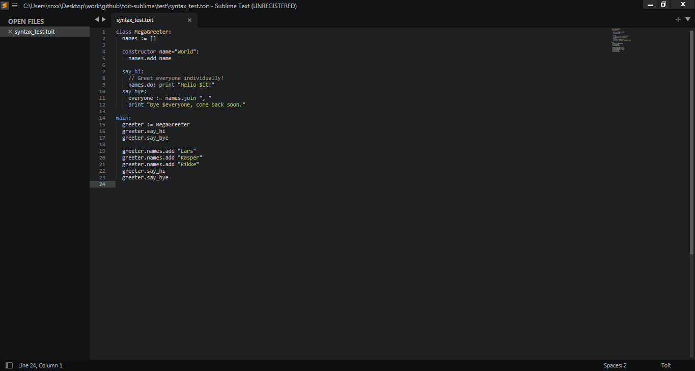

# [Toit programming language][1] syntax highlighting for Sublime Text 3

Syntax definition for `*.toit` files for Sublime Text. The extension `*.toit` is used for convenient programming under esp32.
More information on the [documentation page](https://docs.toit.io/language).

<div align="center">
	
	<article>Toit highlight in dark theme</article>
	
	<article>Toit highlight in light theme</article>
</div>

---

## Installation

Make sure you've [PackageControl](https://packagecontrol.io/) installed, then open: Command Palette &rarr; Install Package &rarr; Toit.

Alternatively, clone this repository into Sublime's Packages directory:

```sh
$ git clone https://github.com/snxx-lppxx/toit-sublime.git -b develop
$ cd toit-sublime
$ xcopy /y /o /e ".\toit-sublime" "%AppData%\Sublime_Text_3\Packages\Toit"
```

## Licensed Agreement of Author with Recipients

For license and copyright information please follow this like: <https://github.com/snxx-lppxx/toit-sublime/blob/master/LICENSE>.
Contact with the [author](https://snxx-lppxx.github.io/).


<!-- Space for external links: -->
[1]: https://toit.io/
